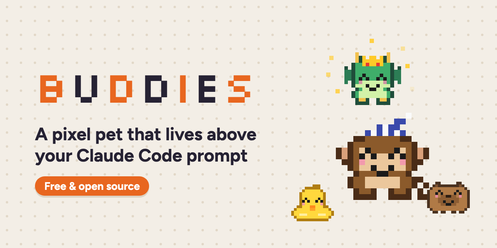
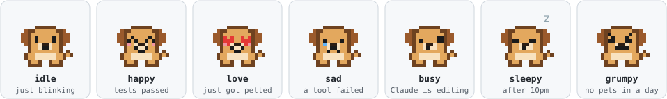
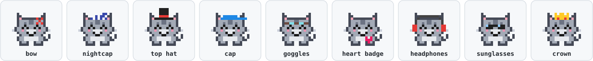

<p align="center"></p>

A pixel-art companion that lives above your prompt in Claude Code. It reacts to your session, grows up as you work together, unlocks accessories, can watch your PRs, Slack mentions and meetings, and can post to a shared leaderboard with your friends.

Your first session after installing hatches a random buddy: one of 16 species (dog, cat, fox, red panda, cow, monkey, pufferfish, otter, ghost, robot, slime, rubber duck, capybara, octopus, bat, mushroom) at a random rarity (common 60%, uncommon 25%, rare 10%). The other 5% of the time you hatch a legendary: a dragon or a skull, which hatch no other way.

<p align="center"></p>

## Requirements

- A recent version of Claude Code. Buddies is a Claude Code mod, a plugin that hooks into Claude Code itself; if `/buddy` doesn't show up after installing, update Claude Code.
- The desktop app's Code tab for the pixel art. The terminal draws your buddy in text instead.
- The GitHub CLI (`gh`), signed in, for PR alerts.
- A claude.ai account for leaderboards.

## Install

At a Claude Code prompt, add the marketplace and install the plugin, picking the user scope:

```
/plugin marketplace add briannaworkman/buddies
/plugin install buddy@buddies
```

Your buddy hatches right away, or in your next session. To change how your buddy works, install from your own copy instead; see [Make it yours](#make-it-yours).

## Updating

Buddies doesn't number its releases, so `/plugin update` reports that you're already up to date. To get the latest version, refresh the marketplace and reinstall:

```bash
claude plugin marketplace update buddies
claude plugin uninstall buddy@buddies && claude plugin install buddy@buddies --scope user
```

Then run `/reload-plugins` in any open session. Your buddies and progress stay put, since Claude Code keeps them apart from the plugin's files.

## What it does

- **Reacts to your session**: narrates what Claude is up to with Claude Code's own spinner verbs and its species' habits, winces when a tool fails, and celebrates passing tests and finished turns.
- **Grows up**: baby (in its eggshell) until level 5, grown-up until 10, then radiant with golden sparkles. Every finished turn is 1 xp.
- **Moods**: greets you by time of day, gets sleepy after 10pm, and grumpy if you haven't petted it in a day.
- **Streak**: a 🔥 day streak in the band, shared by all your buddies.
- **Accessories** you unlock and wear: 🎀 bow, 🌙 nightcap, 🎩 top hat, 🧢 cap, 🥽 goggles, 💗 heart badge, 🎧 headphones, 😎 sunglasses, 👑 crown.
- **Watches** your open PRs for approvals and requested changes, your Slack mentions, and meetings starting in the next 10 minutes.
- **Pixel art** in the desktop app; ASCII art in the terminal.

### Moods

Its face follows what's happening in your session.



### Growing up

Buddies start in their eggshell, grow up at level 5 and turn radiant at level 10. Rare buddies sparkle, and legendaries sparkle gold.



### Wardrobe

Nine accessories, each unlocked by something you do together. `/buddy items` shows how to earn the ones you haven't found yet.



### In the terminal

The terminal draws your buddy in three lines of text, tinted by rarity:

```
 /\_/\     ^__^     n___n     /\_^_/\
<(o.o)>   (o.o)    ( o.o )   >(^.^)<
  \v/~~    (oo)    (__-__)    /vvv\~
  fox      cow    capybara   dragon
```

## Commands

| Command | What it does |
| --- | --- |
| `/buddy` | Your buddy's card: level, xp, streak, items |
| `/buddy pet` | Pet it (so does the **pet** button in the band) |
| `/buddy chat <message>` | Talk to it; it answers in character |
| `/buddy items` | Your wardrobe, with hints for locked items |
| `/buddy wear <item>` or `/buddy wear none` | Change what it's wearing |
| `/buddy adopt <species> [name]` | Hatch another buddy and swap it in (any species but the legendaries) |
| `/buddy switch <name>` | Swap which buddy is in your band |
| `/buddy season <month> <name>` | Make a buddy move in automatically that month (`off` to clear) |
| `/buddy roster` | Rank your own buddies |
| `/buddy share` | Copy your buddy card to post on your leaderboard page |
| `/buddy leaderboard <link>` · `/buddy leaderboard off` | Join a leaderboard (or leave it) |
| `/buddy:new-leaderboard [name]` | Start your own leaderboard page |
| `/buddy rename <name>` · `/buddy hide` · `/buddy show` | |

## Settings

Change these in the plugin's settings (`/plugin`, then buddy):

- **GitHub organization** (default: empty): only your PRs in this org count for approval reactions. Leave empty for all of your PRs.
- **Leaderboard page** (optional): your leaderboard's link. `/buddy leaderboard <link>` sets it for you.
- **Watch Slack mentions** (off by default): alert when you're mentioned in Slack.
- **Watch calendar** (off by default): alert when a meeting starts in the next 10 minutes.

## Optional: Slack and Calendar alerts

Turn on **Watch Slack mentions** or **Watch calendar** in the settings. Buddy then checks every 2 minutes, but only calls the connector when your settings already allow it, so it never pops a permission prompt. Add your Slack search and Calendar list-events tools to `permissions.allow` in `~/.claude/settings.json`, and run `/buddy` to see which ones it's still waiting on. The PR watcher is always on and needs the GitHub CLI (`gh`) signed in.

## Start a leaderboard

A leaderboard is a shared page where you and your friends post your buddies. It draws everyone's buddy, accessories and all, and ranks players by total xp. Leaderboards live on claude.ai, so everyone in one needs a claude.ai account.

**Start one:** run `/buddy:new-leaderboard Office Pets` in Claude Code (any name works). Claude publishes a new leaderboard page to your claude.ai account, names it, and connects your buddy to it.

**Invite friends:** open the leaderboard page's **Share** menu and add each friend **by email as an Editor**. Only people invited that way, or members of your own claude.ai organization, can post; anyone else with the link can only watch. Editors can also change the page, so invite people you trust. Then send them the link.

**Join one:** install Buddies, then run `/buddy leaderboard <link>` with the link you were sent.

**Post your buddy:** run `/buddy share` to copy your buddy card, open the leaderboard page, and paste it in with the name you want to show. Post again any time to update your spot; you keep the same place in the leaderboard.

The leaderboard owner can rename the leaderboard and remove entries from the page itself. Buddy also keeps your latest card in `~/.claude/buddy/card.json` while you're on a leaderboard, if you'd like a scheduled task to post it for you.

## Make it yours

Installing from GitHub gives Claude Code its own copy, which the next update replaces. To make changes that stick, clone the repo and install from your clone, so Claude Code reads buddy straight from that folder:

```bash
git clone https://github.com/briannaworkman/buddies ~/code/buddies
```

If you already installed Buddies from GitHub, remove that copy first:

```bash
claude plugin uninstall buddy@buddies
claude plugin marketplace remove buddies
```

Then install from your clone:

```bash
claude plugin marketplace add ~/code/buddies
claude plugin install buddy@buddies --scope user
```

Your buddies and progress carry over. Now you can edit the files and run `/reload-plugins` to see each change. The easiest way is to open a Claude Code session in `~/code/buddies` and ask, for example "make my buddy talk like a pirate" or "make my ghost purple".

To edit by hand, these are the places to look:

| Want to change | Look for |
| --- | --- |
| What buddy says (prompt cheers, test celebrations, idle mumbles, grumpy lines) | `LINES` in `hooks/data.ts` |
| Working verbs ("*Pondering…*"), finished-turn cheers, idle chatter, and each species' habits | `WORKING`, `CHEERS`, `IDLE`, `HABITS` in `hooks/vocab.ts` |
| Names a new buddy can hatch with | `NAMES` in `hooks/data.ts` |
| Hatch odds for each rarity | `RARITY` in `hooks/data.ts` |
| Accessories, how to unlock them, and their pixels | `ITEMS` in `hooks/data.ts` |
| The levels where it grows up | `STAGES` in `hooks/data.ts` |
| Night hours (sleepy face and the nightcap) | `NIGHT_FROM`, `NIGHT_UNTIL` in `hooks/data.ts` |
| How long speech lingers, how often it checks GitHub, Slack and Calendar, meeting warning time | `MOOD_MS`, `WATCH_MS`, `MEETING_SOON_MIN` in `hooks/data.ts` |
| How long before it gets grumpy, and greetings | `idleFace`, `greeting` in `hooks/pet.ts` |
| Its chat personality | `chatPersona` in `hooks/text.ts` |
| What counts as a test run | the `isTest` check in `hooks/register.tsx` |

Each species' art is in `hooks/species.ts`: `ascii` is the terminal version, `rows` is a 16×16 grid of letters (one per pixel) for the desktop app, and `palette` maps the letters to colors. To add a species, add its name to `SpeciesName` in `types/index.d.ts`, then add an entry to `SPECIES` in `species.ts` and `HABITS` in `vocab.ts`. Type-checking flags whichever one is missing.

The leaderboard page in `leaderboard/` uses the same sprites. After changing the art or `leaderboard/page.ts`, rebuild it with `node scripts/build-leaderboard.mjs`.

The pictures in this README are drawn from the same sprites. After changing the art, redraw them with `npx tsx scripts/readme-art.ts`. The banner at the top comes from the promo project: `npm run social` in `promo/`, then copy `promo/out/buddies-social-preview.png` to `docs/banner.png`.

`hooks/register.tsx` is the only file that talks to Claude Code. The other files are plain functions, covered by the tests in `tests/`. Run them with `claude plugin test ~/code/buddies`.

If a change breaks something, the transcript shows a dim line naming the problem, and `claude plugin validate ~/code/buddies` checks the plugin. To pick up new versions later, commit your changes on a branch and run `git pull` in your clone.

## Where your buddy lives

Claude Code stores your buddies and progress on your own machine. A few features talk to other services:

- `/buddy chat` sends your message to Claude, the same as any prompt.
- The PR watcher asks GitHub about your open PRs through `gh`.
- Slack and Calendar alerts, once you turn them on, call those connectors.
- Your buddy card leaves your machine only when you paste it on a leaderboard.

## License

MIT, see [LICENSE](LICENSE).
